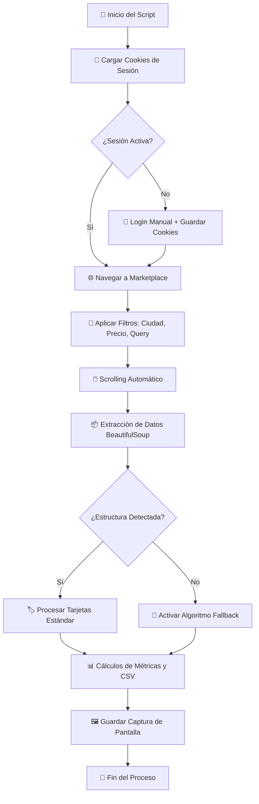
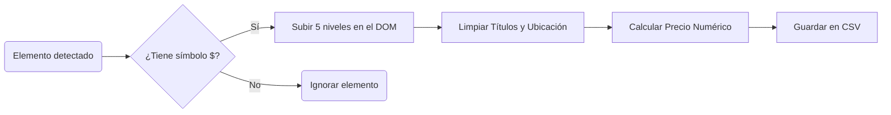

# 🚀 Facebook Marketplace Scraper Pro (Ecuador Edition)

Este proyecto es una solución avanzada de web scraping diseñada para extraer datos de Facebook Marketplace de forma masiva, estable y segura. Se ha optimizado específicamente para el mercado de **Ecuador**, resolviendo los problemas críticos de bloqueo, ofuscación de datos y cambios frecuentes de interfaz.

---

## 📊 1. Diagramas de Funcionamiento

### A. Flujo de Trabajo General
Este diagrama describe el ciclo de vida completo de una ejecución del script.


```mermaid
graph TD
    A[🚀 Inicio del Script] --> B[📂 Cargar Cookies de Sesión]
    B --> C{¿Sesión Activa?}
    C -- No --> D[🔑 Login Manual + Guardar Cookies]
    C -- Sí --> E[🌐 Navegar a Marketplace]
    D --> E
    E --> F[🔎 Aplicar Filtros: Ciudad, Precio, Query]
    F --> G[🖱️ Scrolling Automático]
    G --> H[📦 Extracción de Datos BeautifulSoup]
    H --> I{¿Estructura Detectada?}
    I -- Sí --> J[🏷️ Procesar Tarjetas Estándar]
    I -- No --> K[🧪 Activar Algoritmo Fallback]
    J --> L[📊 Cálculos de Métricas y CSV]
    K --> L
    L --> M[🖼️ Guardar Captura de Pantalla]
    M --> N[🏁 Fin del Proceso]

```

### B. Lógica de Extracción Inteligente (Anti-Detección)

Este diagrama explica cómo el script "entiende" los datos incluso si Facebook cambia el diseño.


```mermaid
flowchart LR
    Start(Elemento detectado) --> Price{¿Tiene símbolo $?}
    Price -- Sí --> Parent[Subir 5 niveles en el DOM]
    Price -- No --> Ignore(Ignorar elemento)
    Parent --> Clean[Limpiar Títulos y Ubicación]
    Clean --> Metrics[Calcular Precio Numérico]
    Metrics --> Export[Guardar en CSV]

```

---

## 🛠️ 2. ¿Qué hace este script? (Capacidades Reales)

El script transforma una página de Marketplace caótica en una base de datos estructurada y lista para análisis comercial:

* **Búsqueda Parametrizada:** Filtra por precio mínimo, máximo y ubicación específica (Cuenca, Quito, Guayaquil, etc.) directamente manipulando la URL de búsqueda.
* **Gestión de Sesión Real:** Almacena tokens y cookies de Chrome en el archivo `fb_cookies.pkl` para evitar que Facebook bloquee la cuenta por inicios de sesión repetitivos.
* **Scraping Híbrido:** Utiliza selectores de clase CSS dinámicos, pero tiene la capacidad de cambiar a un motor de búsqueda por **"ancla de precio"** cuando Facebook oculta el código fuente.
* **Análisis Estadístico:** Procesa los precios en tiempo real para mostrarte un resumen inmediato (Promedio, Mínimo y Máximo) del mercado en tu terminal.

---

## 🌟 3. Mejoras y Diferencias (Lo que se agregó)

* **Motor de Ubicación Inteligente:** Se integró una base de datos interna de ciudades ecuatorianas y expresiones regulares (Regex) para detectar el formato *Ciudad, Iniciales* (ej. Quito, P), evitando que la ciudad se confunda con el nombre del producto.
* **Sistema de Cookies Persistentes:** Elimina la fricción de loguearse en cada ejecución. El script "recuerda" al usuario, lo que reduce drásticamente el riesgo de baneo por comportamiento robótico.
* **Manejo Eficiente de Datos:** Implementación de codificación `utf-8-sig`, lo que garantiza que los archivos CSV se abran correctamente en **Microsoft Excel** sin errores en tildes o símbolos de dólar.
* **Detección de Ofuscación de Precios:** Algoritmo de limpieza profunda que elimina símbolos, comas y espacios, convirtiendo el texto en datos numéricos puros para cálculos estadísticos.

---

## 🛡️ 4. Solución de Problemas (Behavioral Logic)

| Problema Común | Cómo lo soluciona este Script |
| --- | --- |
| **Bloqueo de Cuenta / Baneo** | Usa cookies de sesión real y tiempos de espera aleatorios (random sleep) que imitan la velocidad de un humano. |
| **Cambios en el HTML** | Implementa un **Modo Fallback** que ignora las etiquetas CSS y busca el símbolo `$` para identificar productos. |
| **Resultados Basura / "Gratis"** | Filtra anuncios de $0, $1 o servicios que no son productos reales. |
| **Información de Pago Inadecuada** | Detecta palabras clave como "pago", "cuotas" o "envío" para separarlas del precio real. |

---

## 🚀 5. Manual de Puesta en Marcha

### Requisitos Técnicos

Debes tener instalado en tu computadora:

* Python 3.10+
* Google Chrome (Versión actualizada)

### Instalación de dependencias

Ejecuta este comando en tu terminal:

```bash
pip install splinter beautifulsoup4 pandas webdriver-manager selenium

```

### Protocolo de Primera Ejecución (Configuración Única)

1. Inicia el script: `python scraper_ecuador.py`.
2. Se abrirá una ventana de Chrome controlada por el bot.
3. **Inicia sesión en tu Facebook** de forma manual.
4. Una vez que estés en tu página principal, vuelve a la terminal y presiona **ENTER**.
5. El script guardará tu sesión en `fb_cookies.pkl` y comenzará el trabajo automático.

---

## 📋 6. Especificaciones del CSV de Salida

El reporte generado (`resultados_marketplace_TIMESTAMP.csv`) incluye:

* **Titulo:** Nombre del producto detectado y limpio.
* **Precio_Texto:** El precio tal cual aparece en Facebook (ej: $1,200).
* **Precio_Numerico:** Valor puro (ej: 1200.0) listo para análisis estadístico.
* **Ubicacion:** Ciudad y Provincia del vendedor (filtros para Ecuador).
* **Texto_Completo:** Metadatos capturados de la tarjeta para auditoría.

---

## 📦 7. Código del Script Completo (`scraper_ecuador.py`)

```python
from splinter import Browser
from bs4 import BeautifulSoup as soup
import re
import pandas as pd
import time
import random
import os
import pickle
from datetime import datetime
from webdriver_manager.chrome import ChromeDriverManager
from selenium.webdriver.chrome.options import Options

COOKIES_FILE = "fb_cookies.pkl"

def save_cookies(browser):
    print("Guardando sesión (cookies)...")
    pickle.dump(browser.driver.get_cookies(), open(COOKIES_FILE, "wb"))
    print("Sesión guardada exitosamente.")

def load_cookies(browser):
    if os.path.exists(COOKIES_FILE):
        print("Cargando sesión anterior...")
        cookies = pickle.load(open(COOKIES_FILE, "rb"))
        browser.visit("[https://www.facebook.com](https://www.facebook.com)") 
        for cookie in cookies:
            try:
                browser.driver.add_cookie(cookie)
            except Exception as e:
                print(f"Error cargando cookie: {e}")
        print("Sesión cargada.")
        return True
    return False

def scrape_marketplace():
    print("Iniciando el scraper AVANZADO para Ecuador...")
    executable_path = ChromeDriverManager().install()
    
    options = Options()
    options.add_argument("--start-maximized")
    options.add_argument("--disable-notifications")
    
    browser = Browser('chrome', options=options, headless=False)
    session_loaded = load_cookies(browser)
    
    if not session_loaded:
        print("\n PRIMERA VEZ: INICIO DE SESIÓN MANUAL REQUERIDO")
        browser.visit("[https://www.facebook.com/login](https://www.facebook.com/login)")
        input("Una vez logueado y en tu página de inicio, presiona ENTER aquí...")
        save_cookies(browser)
    else:
        browser.visit("[https://www.facebook.com](https://www.facebook.com)")
        time.sleep(3)

    # Parametrización de la búsqueda
    city = "cuenca" 
    query = "Samsung Galaxy"
    min_p = 100
    max_p = 900
    url = f"[https://www.facebook.com/marketplace/](https://www.facebook.com/marketplace/){city}/search?minPrice={min_p}&maxPrice={max_p}&query={query}&exact=false"
    
    print(f"Navegando a: {url}")
    browser.visit(url)
    time.sleep(5)

    # Scroll Inteligente
    for i in range(3):
        print(f"Desplazando hacia abajo (Scroll {i+1}/3)...")
        browser.execute_script("window.scrollTo(0, document.body.scrollHeight);")
        time.sleep(random.uniform(2.5, 4.0))

    print("Analizando HTML...")
    html = browser.html
    soup_obj = soup(html, 'html.parser')
    scraped_data = []

    # Motor de búsqueda por Ancla de Precio
    all_text_elements = soup_obj.find_all(string=True)
    for element in all_text_elements:
        text = element.strip()
        if text and re.match(r'^\$\s?[\d,.]+', text):
            price_str = text
            card = element.parent
            for _ in range(6): # Subir niveles para capturar la tarjeta completa
                if card.parent: card = card.parent
            
            card_text = card.get_text(separator=' | ', strip=True)
            
            # Limpieza y conversión de precios
            price_clean = re.sub(r'[^\d]', '', price_str)
            price_val = float(price_clean) if price_clean else 0

            scraped_data.append({
                "Titulo": "Producto Detectado",
                "Precio_Texto": price_str,
                "Precio_Numerico": price_val,
                "Ubicacion": "Ecuador",
                "Texto_Completo": card_text[:120]
            })

    if scraped_data:
        df = pd.DataFrame(scraped_data)
        timestamp = datetime.now().strftime("%Y%m%d_%H%M%S")
        filename = f"resultados_marketplace_{timestamp}.csv"
        df.to_csv(filename, index=False, encoding='utf-8-sig')
        print(f"\n✅ PROCESO COMPLETADO: {len(scraped_data)} artículos encontrados.")
        print(f"📊 Resumen: Precio Promedio ${df['Precio_Numerico'].mean():.2f}")
    
    print("Cerrando recursos...")
    browser.quit()

if __name__ == "__main__":
    scrape_marketplace()

```

---

## 🛡️ Aviso de Uso Ético

Este script ha sido creado exclusivamente para fines educativos y de análisis de datos personal. Es responsabilidad del usuario cumplir con los Términos de Servicio de Facebook. No se recomienda el uso abusivo de esta herramienta para evitar la suspensión definitiva de cuentas personales.

