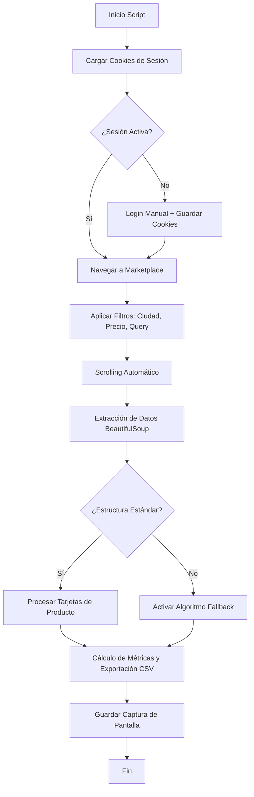

# 🚀 Facebook Marketplace Scraper Pro (Ecuador Edition)

Este proyecto es un scraper avanzado para Facebook Marketplace, optimizado específicamente para el mercado de Ecuador. Utiliza **Python**, **BeautifulSoup**, **Splinter** y **Pandas** para extraer datos de productos de forma eficiente y segura.

## 📊 ¿Cómo funciona?

El script automatiza el proceso de búsqueda y extracción de datos simulando el comportamiento humano para minimizar riesgos de bloqueo.



## ✨ Características Principales

- **Gestión de Sesión Intangible**: Guarda y carga cookies (`fb_cookies.pkl`) para evitar logueos repetitivos y reducir la detección.
- **Detección Inteligente de Ubicación**: Filtra y limpia automáticamente la ubicación de los artículos (Ciudad, Provincia).
- **Algoritmo de Fallback**: Si Facebook cambia sus clases de CSS (algo muy común), el script usa una búsqueda basada en patrones de texto y símbolos de moneda para no detenerse.
- **Métricas Automáticas**: Al finalizar, genera un resumen con el precio promedio, mínimo y máximo de los resultados encontrados.
- **Exportación Robusta**: Guarda los resultados en archivos CSV con timestamp para facilitar el análisis en Excel.

## 🛠️ Problemas Solucionados y Mejoras

### 1. Resistencia a Bloqueos
- **Problema**: Facebook bloquea bots que navegan sin cuenta o con comportamiento errático.
- **Solución**: Implementación de persistencia de sesión por cookies y tiempos de espera aleatorios (`random sleep`).

### 2. Extracción de Títulos y Ubicación
- **Problema**: Los títulos a veces se confunden con la ubicación del vendedor.
- **Mejora**: Se implementó una lógica de clasificación que separa el texto por jerarquía y longitud, asegurando que la columna `Ubicacion` sea precisa.

### 3. Falta de Datos en Cambios de UI
- **Problema**: Facebook actualiza su código HTML frecuentemente, rompiendo los selectores CSS.
- **Solución**: Se añadió un sistema de "Scraping por Patrones" que busca elementos de precio (`$`) y extrae el contexto cercano, garantizando que el scraper siga funcionando incluso si las clases cambian.

## 🚀 Cómo ponerlo en marcha

1. **Instalar dependencias**:
   ```bash
   pip install splinter beautifulsoup4 pandas webdriver-manager selenium
   ```
2. **Ejecutar el script**:
   ```bash
   python scraper_ecuador.py
   ```
3. **Primera ejecución**: Se abrirá una ventana de Chrome. Inicia sesión manualmente. El script guardará tus cookies y no volverás a necesitar loguearte manualmente en el futuro.

## 📋 Requisitos para el CSV
El archivo generado contendrá:
- **Título**: Nombre del producto.
- **Precio_Texto**: Precio tal cual aparece en FB.
- **Precio_Numerico**: Valor numérico para cálculos.
- **Ubicacion**: Ciudad y provincia detectada.
- **Texto_Completo**: Breve contexto del anuncio.

---
*🔥 **Tip**: Usa proxies de alta calidad si planeas hacer scraping a gran escala.*
